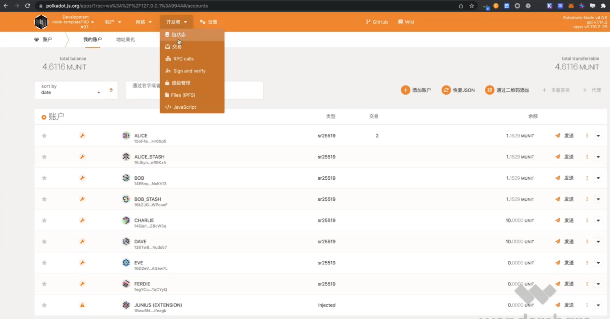

## polkadot js 介绍

1. polkadot js api https://github.com/polkadot-js/api
2. polkadot js extension https://polkadot.js.org/extension/
3. polkadot js app doc: https://polkadot.js.org/docs/
4. substrate.dev https://docs.substrate.io/
5. polkadot wiki https://wiki.polkadot.network/docs/getting-started

## polkadot js app 启动和 UI 界面

1. ### Settings

2. ### Accounts

 

3. ### Network

 

4. ### Developer

 

5. ### Governance

 

## polkadot js 的使用

1. ### 获取常量和变量

 

2. ### 订阅链上数据

 

3. ### 账号管理和交易

 

4. ### 订阅事件

 

## polkadot js 源代码导读

https://github.com/polkadot-js/apps

 

 

 

 

 

 