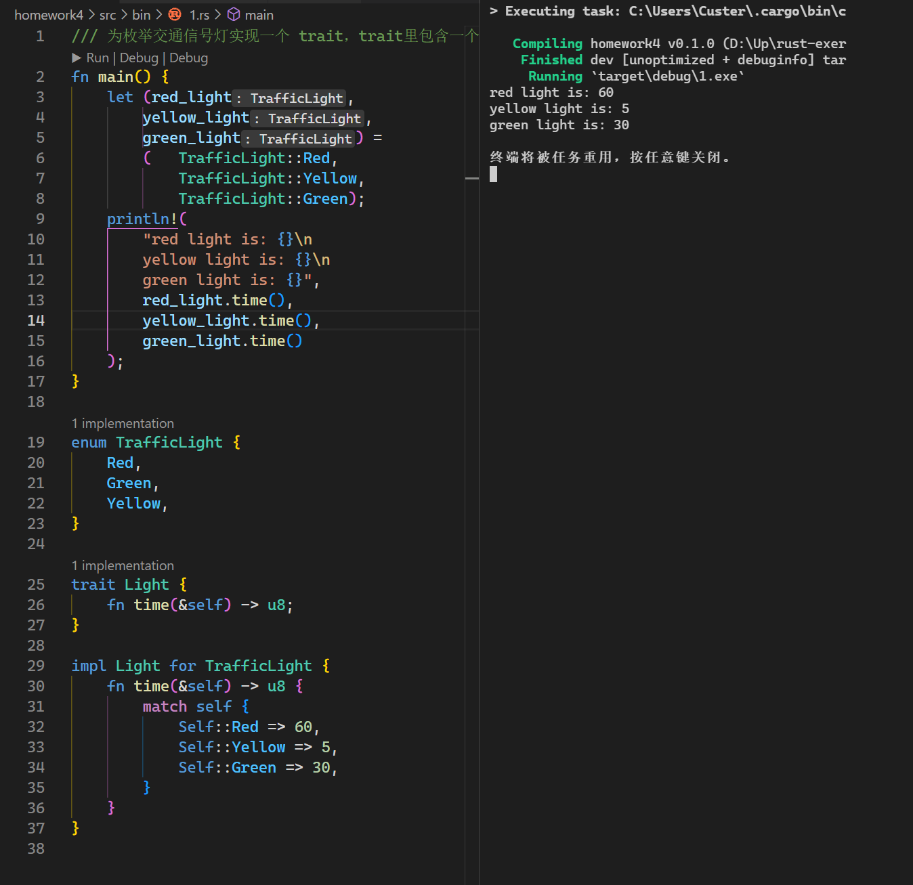
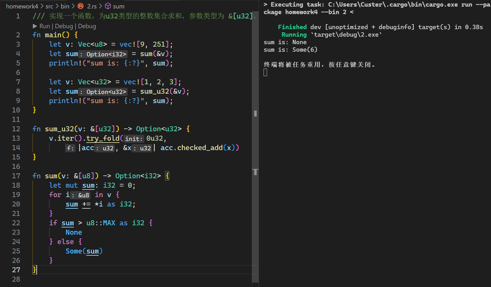
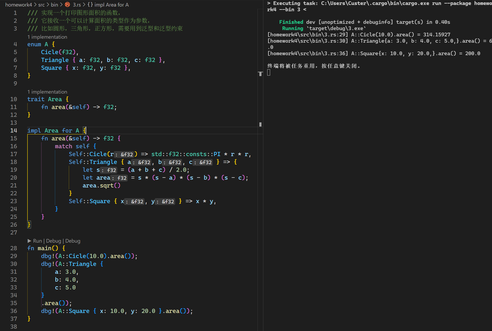

1. 为枚举交通信号灯实现一个 trait，trait里包含一个返回时间的方法，不同的灯持续的时间不同
```rust
fn main() {
    let (red_light, yellow_light, green_light) =
        (TrafficLight::Red, TrafficLight::Yellow, TrafficLight::Green);
    println!(
        "red light is: {}\nyellow light is: {}\ngreen light is: {}",
        red_light.time(),
        yellow_light.time(),
        green_light.time()
    );
}

enum TrafficLight {
    Red,
    Green,
    Yellow,
}

trait Light {
    fn time(&self) -> u8;
}

impl Light for TrafficLight {
    fn time(&self) -> u8 {
        match self {
            Self::Red => 60,
            Self::Yellow => 5,
            Self::Green => 30,
        }
    }
}

```



2. 实现一个函数，为u32类型的整数集合求和，参数类型为 &[u32]，返回类型为Option，溢出时返回None
```rust
fn main() {
    let v:Vec<u8> = vec![9, 251];
    let sum = sum(&v);
    println!("sum is: {:?}", sum);

    let v: Vec<u32> = vec![1,2, 3];
    let sum = sum_u32(&v);
    println!("sum is: {:?}", sum);
}

fn sum_u32(v: &[u32]) -> Option<u32> {
    v.iter().try_fold(0u32, |acc, &x| acc.checked_add(x))
}

fn sum(v: &[u8]) -> Option<i32> {
    let mut sum:i32 = 0;
    for i in v {
        sum += *i as i32;
    }
    if sum > 255 {
        None
    } else {
        Some(sum)
    }
}
```



3. 实现一个打印图形面积的函数，它接收一个可以计算面积的类型作为参数，比如圆形，三角形，正方形，需要用到泛型和泛型约束
```rust
enum A {
    Cicle(f32),
    Triangle { a: f32, b: f32, c: f32 },
    Square { x: f32, y: f32 },
}

trait Area {
    fn area(&self) -> f32;
}

impl Area for A {
    fn area(&self) -> f32 {
        match self {
            Self::Cicle(r) => std::f32::consts::PI * r * r,
            Self::Triangle { a, b, c } => {
                let s = (a + b + c) / 2.0;
                let area = s * (s - a) * (s - b) * (s - c);
                area.sqrt()
            }
            Self::Square { x, y } => x * y,
        }
    }
}

fn main() {
    dbg!(A::Cicle(10.0).area());
    dbg!(A::Triangle {
        a: 3.0,
        b: 4.0,
        c: 5.0
    }
    .area());
    dbg!(A::Square { x: 10.0, y: 20.0 }.area());
}

```


