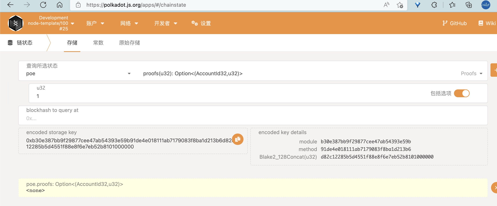
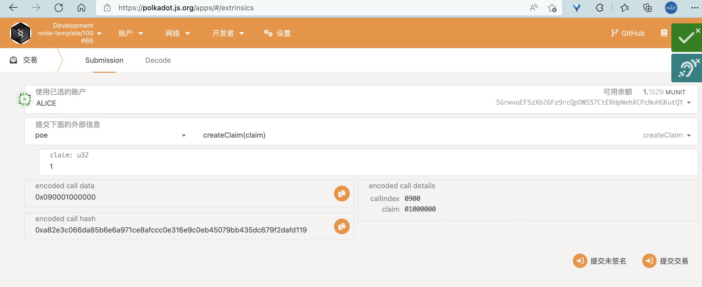
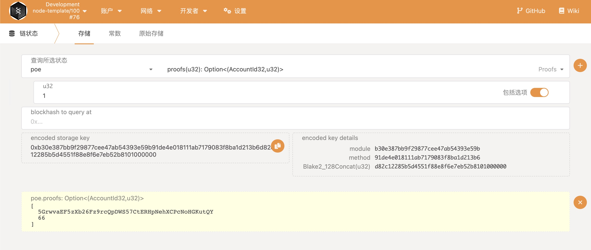
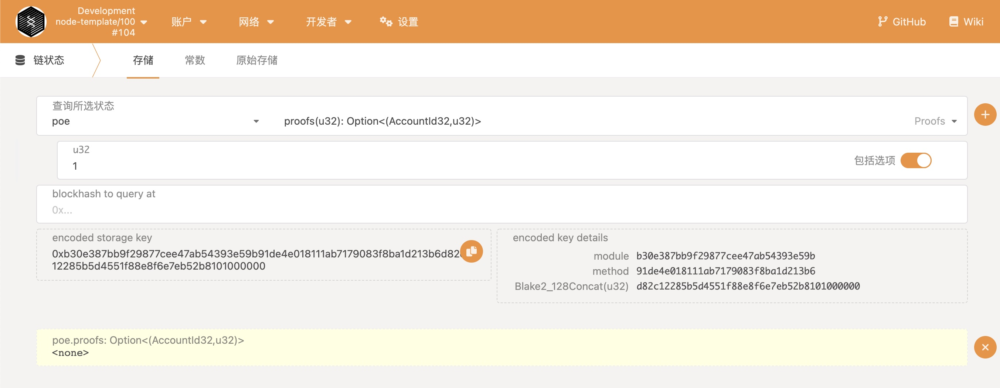
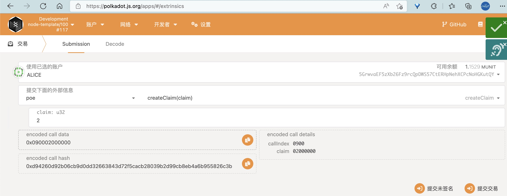
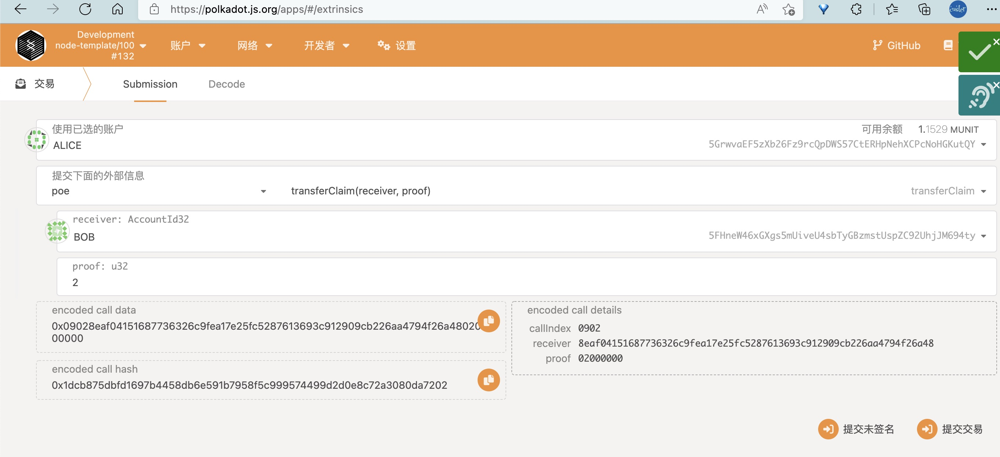
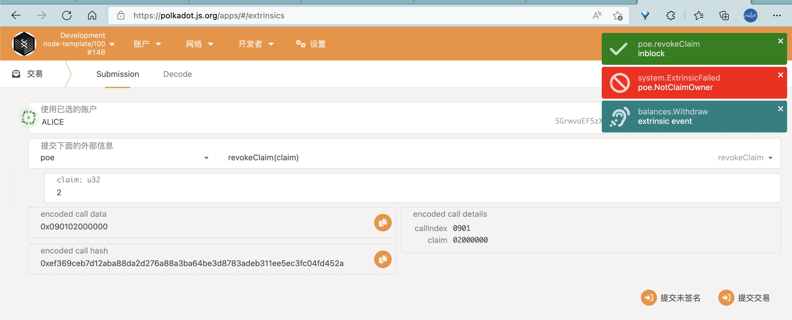
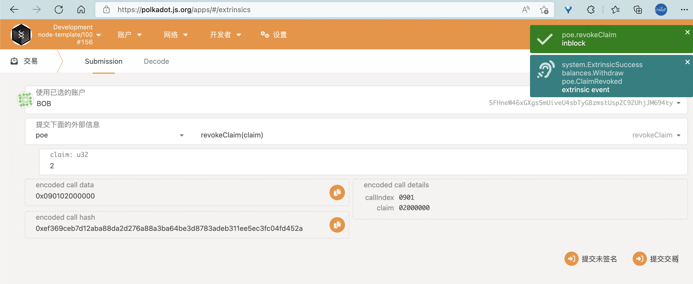

```sh
cargo build --release
```

编译成功之后运行
```sh
./target/release/node-template --dev --tmp
```

首先查看链状态，没有存储这个key所对应的记录



接着选择开发者交易，来创建存证记录



再次检查链的状态



撤销存证，并查看状态



转移存证

先 alice 创建存证 2



alice 转移存证 2 给 bob



alice 撤销存证 2 失败



bob 撤销存证 2 成功

