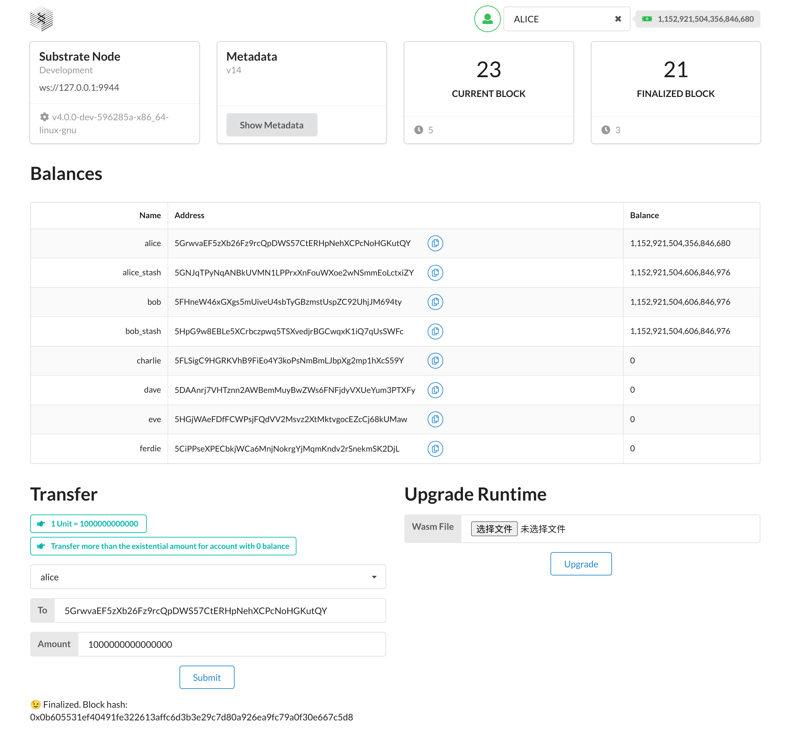
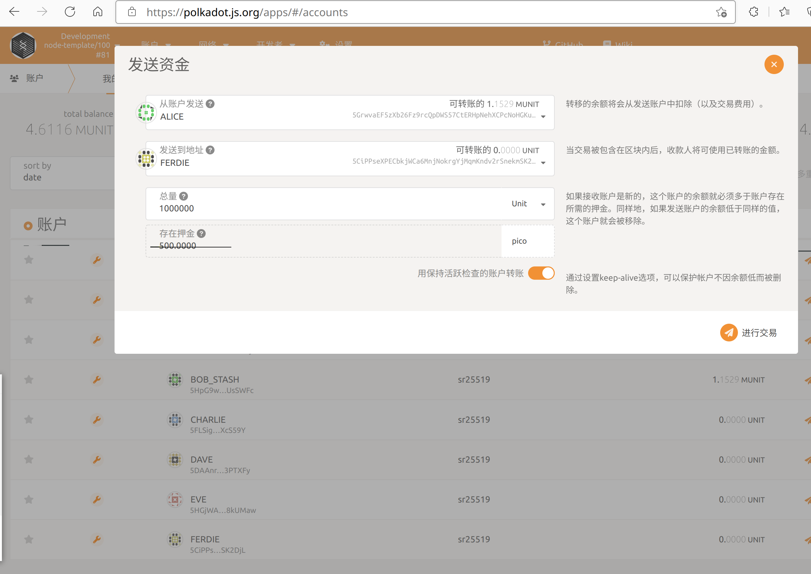
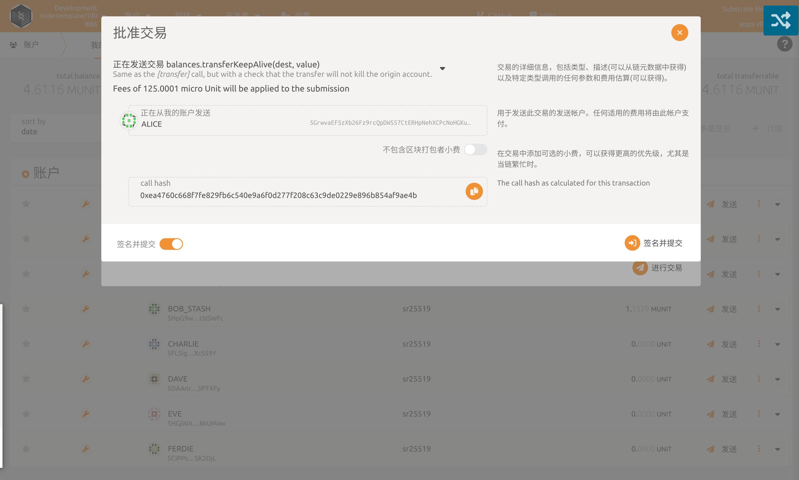

# 与你的节点交互

## 安装前端模板

前端模板使用 [ReactJS]() 框架搭建， 与你的区块链进行交互。前端模板需要使用 [Yarn]() 和 [Node.js]()，首先安装他们

```bash
node --version
yarn --version
npm install -g yarn
git clone https://github.com/substrate-developer-hub/substrate-front-end-template
cd substrate-front-end-template
git checkout latest
yarn install
yarn start
```

在浏览器中打开 http://localhost:8000/substrate-front-end-template，查看前端模板。

在浏览 Polkadot UI 前输入 ` ./target/release/node-template --dev --tmp`，启动并运行你的链。



请注意，稍后我们将在 Section 1 > Viewing a Structure 的 "Registering a Custom Struct" 一节中导入带有其它类型定义的 JSON 文件。

也可以使用polkadot-js访问节点

上面是使用了substrate的前端模板来访问刚才启动的节点。但是在实际的开发中，后端人员其实更多的使用polkadot-js-app来访问我们的节点。访问方式如下：

```
1、在浏览器中输入 https://polkadot.js.org/apps；
2、点击左上角会展开；
3、在展开的菜单中点击DEVELOPMENT；
4、点击Local Node；
5、点击switch。
```

此时就可以看到连到了node-template节点的界面，可以看到链相关的一切信息。

让我们进入 **Account** 选择 **Transfer** 页面并进行交易。名为 "ALICE" 的默认帐户预先存储了大量的 *Units*。

通过发送交易与 "FERDIE" 分享一些。你应该会在交易完成时看到确认信息，并且 FERDIE 的余额也会更新。





到这里，你已经看到了我们创建、运行并且与我们自己的本地 Substrate 链进行交互的整个过程是有多么快速。


- https://docs.substrate.io/tutorials/v3/create-your-first-substrate-chain/#start-the-front-end-template
