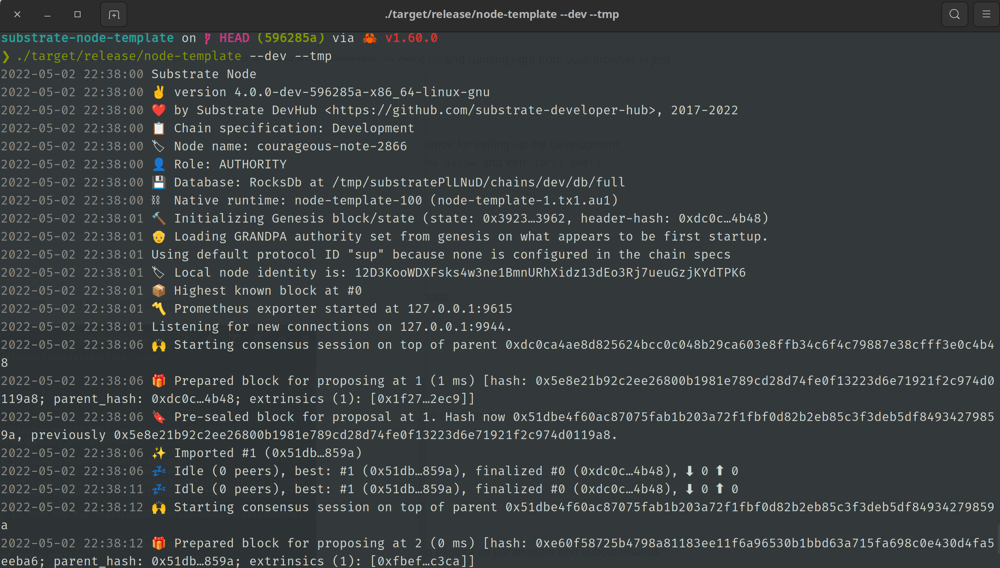

# 创建 substrate 第一条链

substrate官方教程里面的[第一课](https://docs.substrate.io/tutorials/v3/create-your-first-substrate-chain/)叫创建我们的第一条链，这个教程里是把用 substrate 已经开发好的模板 [substrate-node-template](https://github.com/substrate-developer-hub/substrate-node-template) 的代码拉下来，编译，然后再启动起来。

## 1 substrate开发环境

编译substrate模板主要需要一些预编译包和Rust开发环境，安装的命令如下：

```
# 1.安装预编译包
sudo apt update && sudo apt install -y git clang curl libssl-dev llvm libudev-dev

# 2.安装Rust编译环境
curl https://sh.rustup.rs -sSf | sh
source ~/.cargo/env
rustup default stable
rustup update
rustup update nightly
rustup target add wasm32-unknown-unknown --toolchain nightly
```

执行完上述命令后，可以用如下命令进行查看：

```
rustc --version
rustup show
```

至此，编译环境就准备好了。

## 2 启动链的节点

接下来就是启动链的节点，这里要用到node-template的代码。node-template实际上是官方提供的使用substrate开发的模板链，可以理解为substrate官方提供的样例，后续任何人想使用substrate可以在这个样例的基础上进行修改，这样开发链就更方便。这就好比以前的好多山寨链，在btc的源码上改下创世区块的配置，就是一条新链。那么substrate其实也一样，提供了node-template这样一个模板，后续根据需求在这个上面改吧改吧，就能产生一条新链。

当然我们这里是快速演示，所以就不需要修改，直接使用就行了。

### 2.1 下载node-template

命令如下：

```
git clone https://github.com/substrate-developer-hub/substrate-node-template
cd substrate-node-template
git checkout latest
```

### 2.2 编译

命令如下：

```
cargo build --release
```

### 2.3 运行节点

```
./target/release/node-template --dev --tmp
```

至此，我们就把使用substrate开发的模板链的节点启动起来了，不过我们此时启动的链只有一个节点。



## 3 使用polkadot-js访问节点

在substrate官方的教程中，是使用了substrate的前端模板来访问刚才启动的节点。但是在实际的开发中，后端人员其实更多的使用polkadot-js-app来访问我们的节点，所以这里我们也使用它来访问我们的节点。

访问方式如下：

```
1、在浏览器中输入https://polkadot.js.org/apps；
2、点击左上角会展开；
3、在展开的菜单中点击DEVELOPMENT；
4、点击Local Node；
5、点击switch。
```

此时就可以看到连到了node-template节点的界面，可以看到链相关的一切信息。

## 4 参考文献

https://docs.substrate.io/tutorials/v3/create-your-first-substrate-chain/
